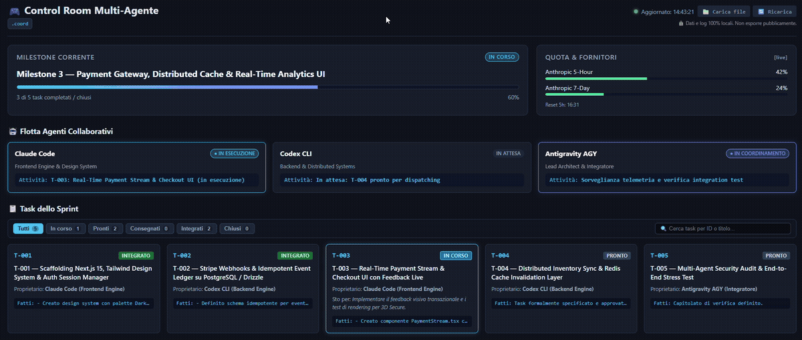

# Vibe Multiagent 🤖⚡

<p align="center">
  
</p>

[](https://github.com/acarducci65-svg/vibe-multiagent-public/actions/workflows/ci.yml)
[](LICENSE)
[](https://docs.anthropic.com/en/docs/claude-code)
[](https://github.com/google)
[](https://nodejs.org)
[](CODE_OF_CONDUCT.md)

> **Framework e Skill per l'avvio, coordinamento e orchestrazione di progetti di sviluppo multi-agente con Claude Code, Antigravity (AGY) e Codex CLI.**

`vibe_multiagent` è una skill universale per lo sviluppo software assistito da AI, progettata per orchestrare team di agenti di codifica locali in abbonamento (senza costi API a consumo per token). Fornisce una rigida separazione dei ruoli, presidi meccanici di sicurezza (hook), Control Room visiva (`dashboard.html`) e una completa tracciabilità su disco tramite filesystem e Git.

> 💡 **Dogfooding & Trasparenza**: Questo intero framework, la suite di test e i presidi meccanici sono stati ideati, ingegnerizzati e collaudati in modalità multi-agente autonoma dagli stessi agenti AI (**Google Antigravity AGY**, **Claude Code** e **OpenAI Codex CLI**) sotto la costante supervisione e direzione architetturale umana di **Alessandro Carducci** (in pieno rispetto del principio *Human-in-the-Loop* / Direttore).

[English Documentation (Documentazione in Inglese)](README.en.md)

> ⭐ **Ti piace questo framework?** Lascia una stella (*star*) in alto a destra su GitHub: aiuta altri sviluppatori e team a scoprire il progetto!

---

## 📦 Installazione Rapida della Skill

Clona o copia la cartella della skill nel percorso delle skill del tuo ambiente:

### Per Claude Code
```bash
# Linux/macOS
git clone https://github.com/acarducci65-svg/vibe-multiagent-public.git ~/.claude/skills/vibe_multiagent

# Windows (PowerShell)
git clone https://github.com/acarducci65-svg/vibe-multiagent-public.git "$HOME\.claude\skills\vibe_multiagent"
```

### Per Antigravity IDE
```bash
# Copia nella cartella delle skill globali di Antigravity:
# Windows (PowerShell)
git clone https://github.com/acarducci65-svg/vibe-multiagent-public.git "$HOME\.gemini\config\skills\vibe_multiagent"
```

---

## 🎯 Obiettivi Chiave

1. **Multi-Ambiente Flessibile**: Supporto nativo per lavorare dentro **VS Code**, dentro **Antigravity IDE** o da **terminali indipendenti**.
2. **Tre Quote Indipendenti**: Separazione delle risorse tra Anthropic (Claude), Google (AGY/Antigravity) e OpenAI (Codex) per non bloccare lo sviluppo in caso di esaurimento di un singolo fornitore.
3. **Garanzia di Integrazione Intoccabile**: Solo l'**Orchestratore dell'ambiente selezionato** (Claude Code in Ambiente A/C, Antigravity in Ambiente B) valida e porta i task allo stato `INTEGRATO` dopo aver rieseguito personalmente i test e le verifiche.
4. **Presidi Meccanici su Antigravity**: Hook automatici per bloccare comandi distruttivi (`git push`, deploy, migrazioni), checkpoint automatici su disco ad ogni modifica e semaforo di quota preventivo.
5. **Lezioni di Produzione Integrate**: Risoluzione automatica di problemi tipici su Windows (PATH stantio delle CLI, normalizzazione CRLF/LF, conflitti di working tree condivisi).
6. **Control Room Visiva & Streaming in Tempo Reale**: Dashboard HTML5 dark-mode standalone (`dashboard.html`), telemetria di stato (`state.json`) e runner universale (`runner.mjs`) per eliminare l'effetto "scatola nera", monitorando la flotta, i log e l'avanzamento dei task in tempo reale.

---

## 🏗️ I Tre Ambienti di Sviluppo

Durante la fase di setup iniziale, scegli l'ambiente operativo del progetto:

| # | Ambiente | Sede Operativa | Orchestratore & Integratore | Agenti Collaborativi | Caratteristiche & Presidi |
|---|---|---|---|---|---|
| **A** | **VS Code + Claude Extension** | VS Code | **Claude Code** *(Capocantiere & Integratore)* | Codex CLI, AGY CLI | Ideale se il flusso primario vive nell'estensione Claude di VS Code. |
| **B** | **Antigravity IDE** | Antigravity IDE | **AGY** *(Dispatcher & Integratore)* | Claude CLI, Codex CLI | AGY lancia gli esecutori in background, verifica e integra; presidi attivi via `.agents/hooks.json`. |
| **C** | **Terminali Separati** | Shell indipendenti | **Claude Code** *(Capocantiere & Integratore)* | Codex CLI, AGY CLI | Massimo isolamento visivo, coordinamento rigorosamente asincrono via file. |

---

## 🚀 Come Avviare il Setup

Puoi avviare la procedura di setup in qualsiasi nuovo progetto o repository esistente:

### Su Claude Code
Digita nel terminale o nella chat dell'estensione:
```text
avvia progetto con vibe_multiagent
```
*(o trigger equivalenti: "nuovo progetto multi-agente", "setup multiagente", "configura repo multi-agente")*

### Su Antigravity IDE (AGY)
Nella chat agentica di Antigravity, digita:
```text
avvia setup progetto con vibe_multiagent
```

L'agente leggerà il protocollo `setup_skill.md` e avvierà immediatamente l'intervista guidata.

---

## 🗣️ Guida Completa all'Intervista di Setup

L'intervista è il cuore della configurazione: raccoglie le decisioni architetturali, stabilisce i confini di sicurezza e mappa i ruoli e le limitazioni di ogni agente prima di creare qualsiasi file.

### Formato delle Domande
- **Domande a dominio chiuso (0, 0-bis, 2, 4, 9)**: Vengono poste con opzioni interattive a scelta multipla / singola (`AskUserQuestion` / `ask_question`).
- **Domande aperte (1, 3, 5, 6, 7, 8, 10)**: Vengono poste a testo libero, una per messaggio, per approfondire le specifiche.

---

### Le 12 Domande dell'Intervista

```text
┌──────────────────────────────────────────────────────────────────────────────────┐
│                             LE 12 DOMANDE DI SETUP                                │
├──────┬──────────────────────┬────────────────────────────────────────────────────┤
│  0   │ Cartella e Git       │ Dove risiede il progetto e se è già inizializzato   │
│0-bis │ Ambiente di Lavoro   │ Scelta tra Ambiente A, Ambiente B o Ambiente C     │
│  1   │ Problema e Valore    │ Problema da risolvere e criterio di successo V1    │
│  2   │ Utenti e Piattaforme │ Target (web, desktop, mobile, CLI) ed esperienza UX│
│  3   │ Dati e Privacy       │ Dati personali/sensibili, confini e GDPR           │
│  4   │ Stack Tecnologico    │ Linguaggi, framework, database, librerie ammesse   │
│  5   │ Entità e Flussi      │ Da 3 a 5 entità cardine e relazioni principali     │
│  6   │ Integrazioni         │ API terze, device, servizi inclusi ed esclusi      │
│  7   │ Architettura e Test  │ Pattern architetturali e strategia di test         │
│  8   │ Rilascio e CI/CD     │ Branching, hosting, deploy e autorizzazioni utente │
│  9   │ Agenti & Fornitori   │ CLI disponibili, quote, fornitore e sostituzioni   │
│  10  │ Prima Milestone      │ Primo sprint, task iniziali e decisioni riservate  │
└──────┴──────────────────────┴────────────────────────────────────────────────────┘
```

#### Dettaglio delle Domande:

1. **Domanda 0 — Cartella & Git**: Identifica il percorso assoluto del progetto e il nome della cartella di coordinamento (default `.coord/`). Se Git non è presente, chiede se inizializzarlo.
2. **Domanda 0-bis — Sede & Orchestrazione**:
   - `Ambiente A`: VS Code con Claude Code capocantiere e integratore.
   - `Ambiente B`: Antigravity IDE con AGY dispatcher e integratore (con presidi hook).
   - `Ambiente C`: Terminali separati con Claude Code capocantiere e integratore.
3. **Domanda 1 — Scopo & Valore**: Qual è il problema da risolvere, per chi, e quale risultato osservabile definisce il successo della prima versione?
4. **Domanda 2 — Utenti & Piattaforme**: Piattaforme target (web, desktop Electron, mobile, CLI) ed esperienza utente prioritaria.
5. **Domanda 3 — Dati & Confini di Privacy**: Presenza di dati sensibili/personali, conservazione locale vs cloud, e vincoli inderogabili di privacy.
6. **Domanda 4 — Stack & Vincoli Tecnologici**: Tecnologie obbligatorie, preferite o vietate (runtime, DB, librerie) e budget di costo.
7. **Domanda 5 — Entità & Flussi**: Le 3-5 entità cardine dell'applicazione e come i dati fluiscono tra esse.
8. **Domanda 6 — Integrazioni**: Quali servizi esterni o file entrano nella prima versione e quali restano esplicitamente fuori.
9. **Domanda 7 — Architettura & Strategia di Test**: Stile architetturale, livello di disaccoppiamento, harness di test e verifiche minime necessarie prima del rilascio.
10. **Domanda 8 — Ciclo di Sviluppo & Deploy**: Politica di branch, pipeline CI/CD, ambienti di staging/produzione e permessi di deploy riservati all'utente.
11. **Domanda 9 — Agenti, Fornitori e Politica di Quota**:
    - Quali CLI sono autenticate (`claude`, `agy`, `codex`).
    - **Fornitore vs Modello**: Valutazione dei confini dati (es. Sonnet eseguito dentro Antigravity passa dall'infrastruttura Google, non Anthropic).
    - Politica di esaurimento: chi subentra a chi, e quale lavoro invece **non** va sostituito ma aspetta il reset.
12. **Domanda 10 — Prima Milestone & Confini Riservati**: Definizione dello Sprint 1, dei task iniziali e delle decisioni che devono rimanere sempre in capo all'utente umano (Direttore).

---

## 🔍 Preflight Tecnico del Sistema

Prima di confermare l'intervista, la skill esegue verifiche diagnostiche sull'ambiente locale:

```text
[Preflight Check]
├── 1. Risoluzione eseguibili CLI (path fisso vs PATH d'ambiente)
├── 2. Rilevamento sessioni terminali contaminate (ELECTRON_RUN_AS_NODE)
├── 3. Verifica configurazione .gitattributes (normalizzazione LF su Windows)
└── 4. (Ambiente B) Verifica integrità hook globali e cartelle .agents/
```

- **Risoluzione PATH Stantio**: Su Windows, se una CLI è stata installata di recente ma non compare nella sessione aperta, la skill verifica i percorsi noti (`%LOCALAPPDATA%\agy\bin`, `%USERPROFILE%\.claude\...`, npm global) evitando falsi allarmi di assenza.
- **Normalizzazione EOL**: Verifica che `.gitattributes` contenga `* text=auto eol=lf` per evitare fallimenti di test dovuti a conversioni CRLF involontarie.

---

## 📝 Proposta, Approvazione e Generazione File

Al termine dell'intervista, l'agente presenta un **documento di sintesi** contenente:
- Ambiente operativo scelto (A, B o C) e ruoli degli agenti.
- Perimetro consentito e vietato per ciascun ruolo.
- Sintesi architetturale e vincoli non negoziabili.
- Elenco dei file che verranno generati.

> **Regola Aurea**: Nessun file viene scritto su disco finché l'utente non fornisce **approvazione esplicita** ("Sì" o modifiche).

### File Generati nel Progetto:
```text
mio-progetto/
├── AGENTS.md                 # Protocollo operativo e vincoli non negoziabili
├── .agents/                  # (Solo Ambiente B - Antigravity IDE)
│   ├── hooks.json            # Configurazione hook PreToolUse, PostToolUse, PreInvocation
│   └── rules/
│       └── multiagent-coordinator.md # Regola permanente di workspace per il Dispatcher/Integratore
└── .coord/                   # Cartella di coordinamento del progetto
    ├── PROJECT.md            # Fonte unica del contesto di business e architettura
    ├── CURRENT_SPRINT.md     # Milestone attiva, criteri di completamento e rischi
    ├── DECISIONS.md          # Registro decisionale progressivo (D-001, D-002, ...)
    ├── DISPATCH.md           # (Solo Ambiente B) Manuale per il dispatcher AGY
    ├── agents/
    │   ├── verifica-tecnica/agent.md   # Ruolo Codex (se abilitato)
    │   └── verifica-ui/agent.md        # Ruolo AGY (se abilitato)
    ├── tasks/
    │   └── T-001.md          # Specifica del primo task con proprietario e punto di ripresa
    └── handover/             # Cartella di consegna report di fine task
```

---

## 🛡️ Presidi Meccanici (Ambiente B — Antigravity Hooks)

Quando si sviluppa in Antigravity IDE, i divieti e le regole non sono affidati alla "memoria" del modello, ma presidiati da script Node.js eseguiti negli eventi del ciclo di vita:

- **`agy-gate.mjs` (`PreToolUse`)**: Intercetta ed esegue un `deny` immediato per comandi di pubblicazione (`git push`, `npm publish`), deploy cloud (Vercel, AWS, GCP), migrazioni database e flag che bypassano i permessi (`--dangerously-skip-permissions`). Chiede conferma (`ask`) per cancellazioni fuori dal workspace.
- **`agy-checkpoint.mjs` (`PostToolUse`)**: Ad ogni scrittura o modifica di file, scrive automaticamente la riga `- Fatti: <data> — modificati: <file> — ultimo commit: <hash>` nel `Punto di ripresa` del task `IN CORSO`.
- **`agy-quota-banner.mjs` (`PreInvocation`)**: Inietta ad **ogni singolo turno** il promemoria di ruolo perentorio (Coordinatore/Dispatcher & Integratore) per impedire all'agente di agire da programmatore singolo "a mano libera" su nuove richieste/bug, oltre al semaforo di quota Anthropic quando rilevante.
- **`.agents/rules/multiagent-coordinator.md` (Workspace Rule)**: Regola gerarchica permanente caricata nel system prompt di Antigravity che vieta la modifica diretta del codice applicativo e impone la canalizzazione via task.

---

## 🔄 Ciclo di Vita del Task e Gestione Quote

```text
       ┌──────────┐
       │  PRONTO  │
       └────┬─────┘
            │  (Assegna proprietario + compila Punto di Ripresa)
            ▼
       ┌──────────┐      (Errore / Quota esaurita)      ┌──────────┐
       │ IN CORSO ├────────────────────────────────────►│ SOSPESO  │
       └────┬─────┘                                     └────┬─────┘
            │                                                │ (Sostituzione o reset)
            │ (Lavoro ultimato + Handover scritto)           │
            ▼                                                │
        ┌────────────┐                                        │
       │ CONSEGNATO │◄───────────────────────────────────────┘
       └────┬───────┘
            │  (SOLO l'Orchestratore dell'ambiente riesegue verifiche e test)
            ▼
       ┌───────────┐
       │ INTEGRATO │
       └───────────┘
```

### Gestione dell'Esaurimento Quota
Nei file task (`TASK.md`), il costo di sostituzione è suddiviso in due dimensioni distinte:
1. **Costo — Capacità**: Quanto si perde in velocità/qualità delegando a un modello secondario.
2. **Costo — Garanzia**: Quale promessa metodologica decade (es. indipendenza tra chi scrive il codice e chi scrive i test). Se la perdita di garanzia non è accettabile, il task impone:
   ```text
   Agente di ripiego: nessuna sostituzione, attendere il reset
   ```

---

## 🛡️ Lezioni Operative e Robustezza da Progetti Reali

Il protocollo recepisce direttamente le evidenze empiriche maturate sul campo (in progetti complessi e applicazioni reali in produzione):

1. **Verifica su Disco vs Codice di Uscita**:
   - Un agente (es. Codex) può terminare con codice di uscita 1 solo per limite di quota scattato all'ultimo secondo, avendo già completato codice, test e handover al 100%. L'orchestratore **deve sempre verificare `git status` e i file modificati** prima di considerare interrotto un task.
2. **Robustezza per Codex CLI**:
   - **Forzatura Modello (`-m`) e Aggiornamenti**: Specificare `-m <modello>` (es. `-m gpt-6-astra` o `-m gpt-5.6-terra`) e riverificare periodicamente con `codex --version`: i ripieghi temporanei vanno rimossi non appena il CLI si aggiorna.
   - **Autorizzazione Headless**: Il prompt deve esplicitare che l'agente è in modalità non-interattiva per evitare che si fermi in attesa di conferme.
   - **Sandbox e Vitest**: La sandbox di Codex non ha accesso di rete (niente `npm install`) e blocca i sottoprocessi; per eseguire Vitest senza `spawn EPERM`, usare il comando `npx vitest run --configLoader runner <file>`.
3. **Robustezza per AGY CLI**:
   - **Limite sui Comandi Shell Dinamici**: La corrispondenza esatta carattere-per-carattere di `command(...)` rende quasi impossibile pre-autorizzare comandi shell che dipendono da come l'agente li formatta (slash vs backslash, stdout vs file). Usare AGY CLI headless prioritariamente per task con file di input statici già su disco (`read_file`) o verifiche fisse e pre-approvate.
   - **Nomi Modello Reali (`agy models`)**: Verificare sempre i modelli supportati con `agy models` (es. `gemini-3.1-pro-high`, `gemini-3.8-flash-*`) prima di forzare `--model`.
   - **Divieto di Azioni Fuori Perimetro**: Esplicitare nel prompt il divieto di lanciare suite di test globali o comandi pesanti non pertinenti al task (previene timeout).
   - **Permessi Esatti**: Pre-autorizzare in anticipo le verifiche in `settings.json`.
   - **Handover Obbligatorio**: Impone che la scrittura dell'handover sia l'ultima tool call prima di chiudere la sessione headless.
   - **Diagnosi via Transcript (Confermata sul campo)**: In caso di blocco senza indizio (`"jetski: no output produced"`), la lettura di `transcript.jsonl` nel blocco `PLANNER_RESPONSE` individua il comando negato in 1 minuto.
4. **Coordinamento Git nel Working Tree Condiviso**:
   - Mentre un esecutore delegato lavora nel working tree, l'Integratore **non esegue comandi Git in scrittura** (`commit`, `add`, `switch`, `merge`), neppure su altri file (previene conflitti su `index.lock`).
   - L'Integratore posiziona il repository sul ramo target e l'esecutore lavora solo sui file senza toccare Git.
5. **Disciplina delle Fonti Primarie (Divieto di Parafrasi)**:
   - Nessun agente deve trasformare parafrasi o riassunti di handover precedenti in regole: si verifica sempre la fonte primaria.
   - I task devono esporre parametri, liste e dati in modo esplicito e confrontabile per rendere visibili eventuali incongruenze prima della scrittura del codice.
6. **Riverifica dei Ripieghi Tecnici**:
   - Ogni decisione in `DECISIONS.md` che introduce un ripiego temporaneo deve recare una data o condizione di riverifica per non trascinare workaround superati.
7. **Resilienza Filesystem Windows / OneDrive**:
   - Gestione dei lock concorrenti temporanei su `.git/` con retry automatico.

---

## 🎮 Control Room Visiva & Log Streaming (`.coord/dashboard.html`)

Nelle sessioni con molteplici agenti esecutori (Codex, AGY CLI, Claude Code), l'attività in background può apparire come una "scatola nera". `vibe_multiagent` risolve alla radice il problema fornendo una **Control Room interattiva locale**:

- **Dashboard Standalone HTML5**: memorizzata in `{{DIR_COORD}}/dashboard.html`, funziona interamente offline senza dipendenze npm esterne né CDN.
- **Flotta Agenti in Tempo Reale**: monitora con schede animate chi sta lavorando, quale agente è attivo (`Claude Code`, `Codex CLI`, `Antigravity AGY`) e su quale task.
- **Terminale di Streaming Log**: incanalato da `tools/runner.mjs`, permette di selezionare le schede dei task per leggere lo streaming in tempo reale di stdout/stderr con opzione di auto-scrolling.
- **Mini-Kanban dello Sprint**: visualizza l'avanzamento dei task (`PRONTO`, `IN CORSO`, `CONSEGNATO`, `INTEGRATO`, `SOSPESO`), i file riservati toccati e l'ultimo passo completato.
- **Indicatori di Quota & Fornitori**: cruscotto visuale per monitorare i limiti a 5 ore e a 7 giorni.

### Come Aprire la Dashboard:
- **In VS Code**: clic destro su `.coord/dashboard.html` -> *Open with Live Server*, oppure `Ctrl+Shift+P` -> `Simple Browser: Show`.
- **In Antigravity IDE**: apri il file nella finestra di anteprima interna o nel browser predefinito.
- **Da Terminale**: `npx serve .coord` o doppio clic sul file (supporta Drag & Drop di `state.json` in caso di policy restrittive `file://`).

---

## 🔒 Privacy, Sicurezza e Note Legali

### 1. Modello di Sicurezza e Privacy dei Dati
- **Nessuna Telemetria Nascosta & Elaborazione Locale**: `vibe_multiagent` non raccoglie dati, non invia log o codice a server terzi proprietari. L'intero framework vive ed è eseguito **sul filesystem locale**. Lo script opzionale `tools/quota-anthropic.mjs` è **disabilitato di default**; solo se attivato esplicitamente con `VIBE_ANTHROPIC_QUOTA=1`, interroga l'endpoint `api.anthropic.com` con il token locale per verificare la quota token residua. Nessun codice, conversazione o dato di progetto viene mai trasmesso. Per maggiori dettagli, consulta [SECURITY.md](SECURITY.md).
- **Nessun Segreto nel Repository**: Il codice e i template non contengono credenziali, password o chiavi API.
- **Confini Dati Fornitore**: La Domanda 9 dell'intervista distingue esplicitamente tra *modello* e *fornitore*, assicurando che dati aziendali riservati non vengano instradati su canali cloud non approvati.

### 2. Disclaimer sui Marchi Registrati (Trademarks)
- **Anthropic®**, **Claude®** e **Claude Code®** sono marchi registrati di Anthropic PBC.
- **OpenAI®**, **ChatGPT®** e **Codex®** sono marchi registrati di OpenAI, Inc.
- **Google®** e **Antigravity®** sono marchi registrati di Google LLC.
- **Microsoft®**, **Windows®** e **Visual Studio Code / VS Code®** sono marchi registrati di Microsoft Corporation.

*`vibe_multiagent` è un progetto open-source indipendente sviluppato dalla community e non è affiliato, approvato, sponsorizzato o supportato ufficialmente da Anthropic, Google, OpenAI o Microsoft.*

### 3. Limitazione di Responsabilità
Il software viene fornito "così com'è" (*AS IS*), senza garanzie di alcun tipo, espresse o implicite. L'utente finale mantiene il pieno controllo e la responsabilità delle azioni, dei comandi shell eseguiti dalle CLI orchestrate e delle modifiche apportate ai propri repository.

---

## 🧪 Esecuzione dei Test Unitari dei Tool

Per verificare l'intera suite di strumenti meccanici e telemetrici multipiattaforma in un solo comando:
```bash
npm test
```

Oppure per eseguire i singoli moduli di test:
```bash
node tools/test/agy-gate.test.mjs
node tools/test/agy-checkpoint.test.mjs
node tools/test/quota-anthropic.test.mjs
node tools/test/agy-quota-banner.test.mjs
node tools/test/telemetry.test.mjs
node tools/test/runner.test.mjs
```

---

## 📂 Struttura del Repository

```text
vibe-multiagent/
├── .github/
│   └── workflows/
│       └── ci.yml                # CI multipiattaforma (Ubuntu, Windows, macOS)
├── .gitattributes                # Normalizzazione LF cross-platform
├── .gitignore                    # Esclusioni per file volatili e telemetria
├── package.json                  # Definizione pacchetto e script npm test
├── LICENSE                       # Licenza MIT (Alessandro Carducci)
├── SECURITY.md                   # Policy di sicurezza e trasparenza quote
├── CONTRIBUTING.md               # Guida per contributori esterni
├── CODE_OF_CONDUCT.md            # Codice di condotta Contributor Covenant
├── README.md                     # Documentazione principale in italiano
├── README.en.md                  # Documentazione internazionale in inglese
├── SKILL.md                      # Entry point principale per Claude Code
├── setup_skill.md                # Protocollo completo di intervista e setup
├── templates/                    # Template per i file di progetto
│   ├── AGENTS.md.template
│   ├── AGENT_ROLE.md.template
│   ├── CURRENT_SPRINT.md.template
│   ├── dashboard.html.template   # Control Room visiva interattiva (dark mode)
│   ├── DECISIONS.md.template
│   ├── DISPATCH.md.template      # Guida operativa Dispatcher AGY (Ambiente B)
│   ├── HANDOVER.md.template
│   ├── hooks.json.template       # Configurazione hook Antigravity (Ambiente B)
│   ├── multiagent-rule.md.template # Regola permanente di workspace Antigravity (Ambiente B)
│   ├── PROJECT.md.template
│   └── TASK.md.template
└── tools/                        # Script per hook Antigravity, runner & telemetria
    ├── agy-gate.mjs              # Guardrail PreToolUse anti-distrazione
    ├── agy-checkpoint.mjs        # Checkpoint PostToolUse dei fatti su disco
    ├── agy-quota-banner.mjs      # Banner PreInvocation e semaforo quote
    ├── quota-anthropic.mjs       # Sensore quota Claude (opt-in VIBE_ANTHROPIC_QUOTA=1)
    ├── runner.mjs                # Runner universale con multiplexing streaming log
    ├── telemetry.mjs             # Motore di telemetria e generazione state.json
    └── test/                     # Suite di test automatizzati per i tool
        ├── agy-gate.test.mjs
        ├── agy-checkpoint.test.mjs
        ├── agy-quota-banner.test.mjs
        ├── quota-anthropic.test.mjs
        ├── runner.test.mjs
        └── telemetry.test.mjs
```

---

## 🤝 Community, Contributi e Codice di Condotta

Accogliamo con favore contributi, issue e idee da parte della community:
- Consulta la [Guida per i Contributori](CONTRIBUTING.md) per comprendere il flusso di lavoro e le regole di sviluppo (standard zero-dipendenze, test deterministici e igiene privacy).
- Per garantire un ambiente aperto, inclusivo e privo di molestie, la partecipazione al progetto è regolata dal nostro [Codice di Condotta](CODE_OF_CONDUCT.md) (adattato dal Contributor Covenant v2.1).
- Per approfondire il modello di sicurezza o segnalare vulnerabilità, fai riferimento alla nostra [Policy di Sicurezza](SECURITY.md).

---

## 📄 Licenza

Distribuito sotto licenza **MIT** © 2026 Alessandro Carducci. Consulta il file [LICENSE](LICENSE) per maggiori dettagli.
